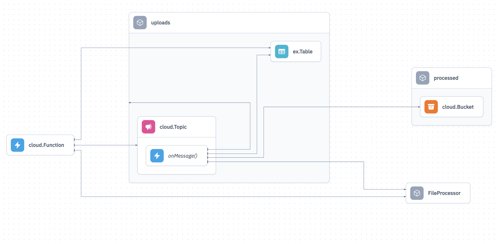
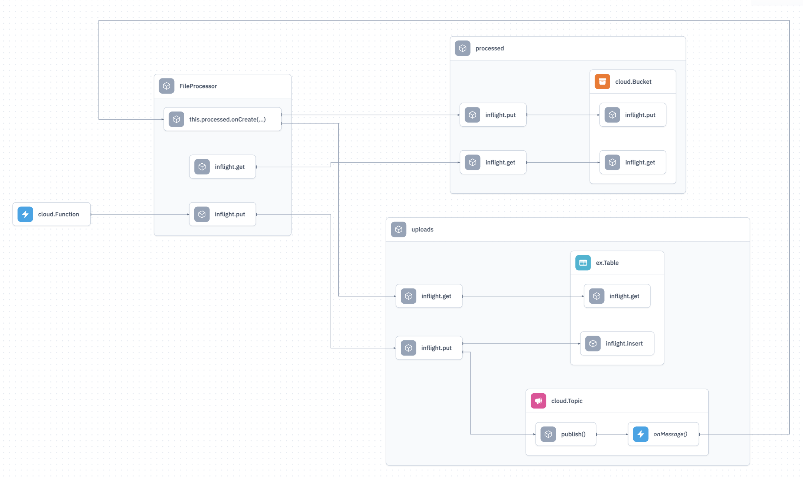

# console-map-issues

## Current map

The current map doesn't really show useful data, since it is a mix of infrastructure relationships and logical relationships. It's really hard to understand what's going on.

## Inflights

Ignoring the design, the inflight nodes help to understand the logical relationships between the different components. If we had this kind of information, we could build very interesting stuff such as user flows (eg, what resources would be affected if a user hits an API route?).

Apart from knowing the inflight nodes and their relationships, we would like to have access to the inflight functions' metadata (eg, which file they are defined in, which line they start and end, etc).
